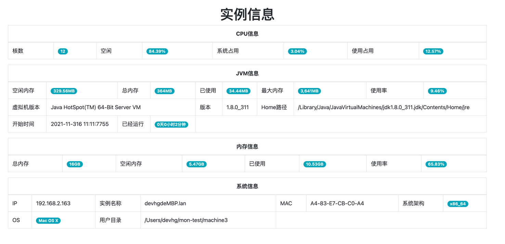
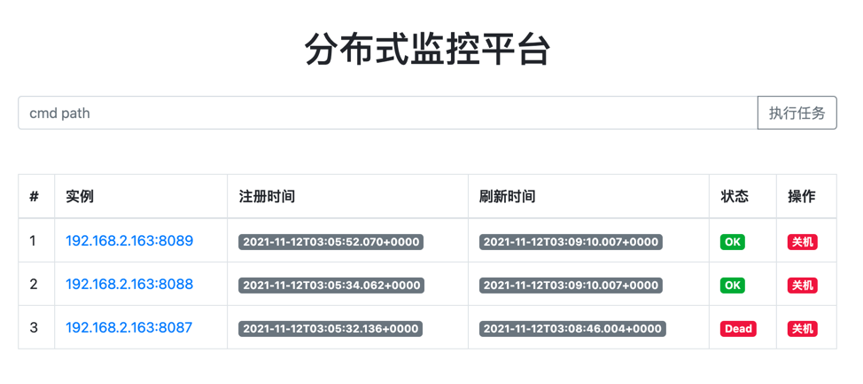
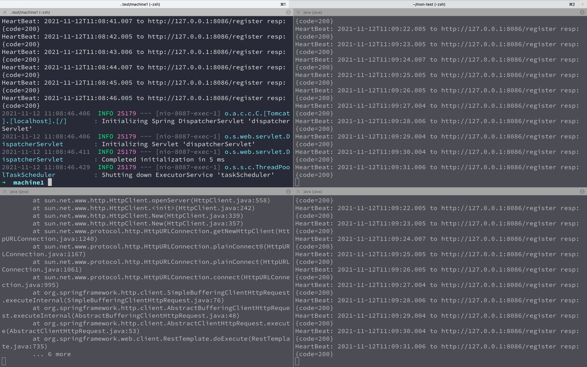
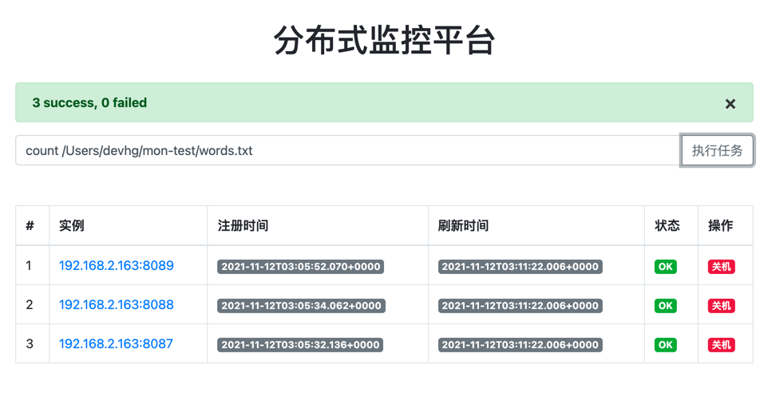
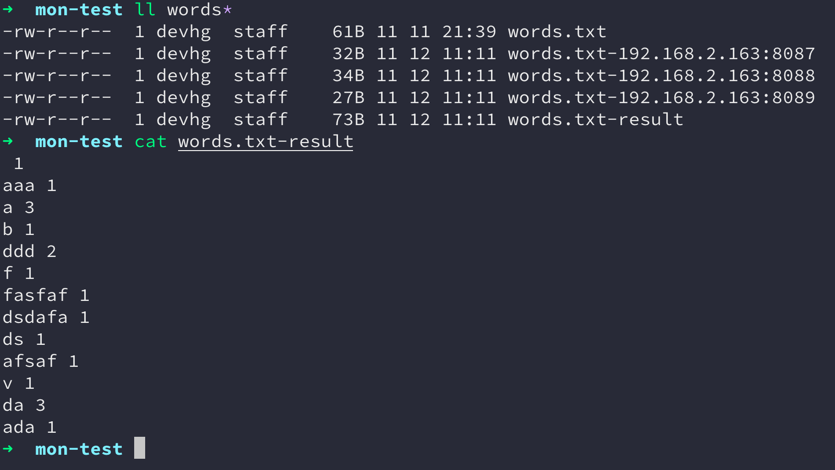

# 分布式监控

* SpringBoot
* Freemarker
* oshi

## 核心原理

sysmon模块作为一个探测程序，实时采集系统的内存CPU等信息。并且每隔一秒向registry模块发送自己的心跳信息。同时sysmon模块也提供了一系列的接口返回系统信息。 同时sysmon监控的程序还可以完成一些任务工作。

## 示例
参考example文件夹，分别运行registry、machine1-3文件夹下的jar包

## 功能展示

### 监控功能

通过服务器监控各客户主机的状态（包括系统启动、系统开关机、CPU、内存状态），利用WEB网页或其他UI展示主机监控功能。主机监控的功能包括监控各主机的状态。

提供一定的远程控制功能（关闭实例进程）。

### 任务分配

通过任务命令的形式实现，也就是说需要手动一些指令。 例如

* `count xxxxx.txt` 统计文档
* `write xxxxx.txt` 分配任务给多实例读写文档
* ....

任务分配功能，系统功能界面参考如下：

创建一个words.txt来统计里面的单词出现的次数。

发布 `count ${file path}`指令来发布统计任务，registry模块在收到指令后，会按照 sysmon 实例的数量均匀的散列拆分需要统计的words.txt, 拆分为words.txt-${实例ip:
port}等多个子文件。 之后向所有的实例发送计算指令请求，待所有的实例完成相应的任务之后会通知到registry，之后registry模块会将所有的结果进行归并，归并后写入 结果文件。

